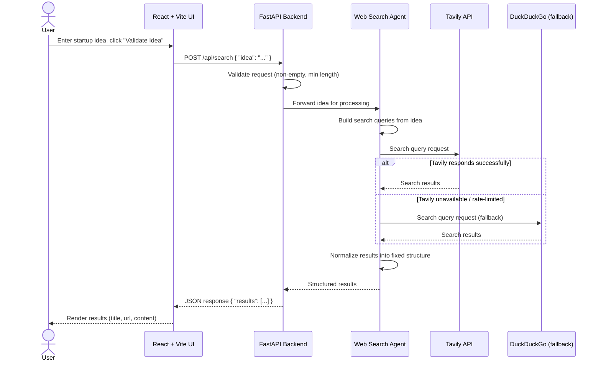
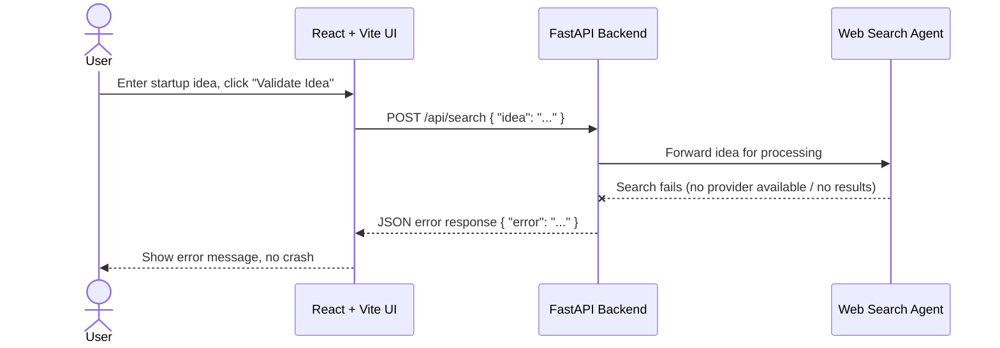

# NEXUS-ISB7 — Sequence Diagram

This document shows the step-by-step sequence of calls for a single "Validate Idea"
request. See [architecture.md](./architecture.md) for the full system architecture and component responsibilities.

## Error path

## Notes

- Only one search provider is used per request — Tavily first, DuckDuckGo only as a
  fallback if Tavily fails or is rate-limited. They are not called in parallel.
- The FastAPI layer is the only component the frontend talks to directly; it never
  calls Tavily/DuckDuckGo itself, and the React UI never calls them either.
- Errors at any step return a JSON error object rather than crashing, and the UI is
  responsible for rendering that as a user-facing message.
